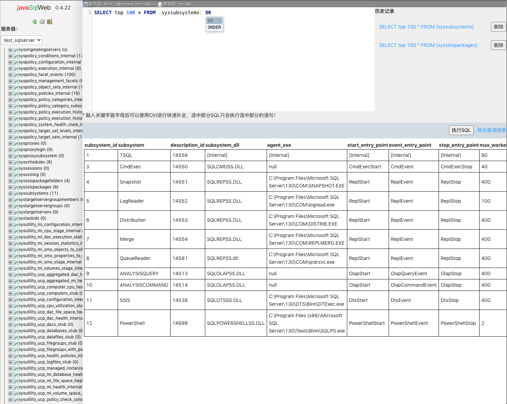
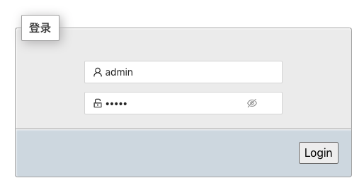
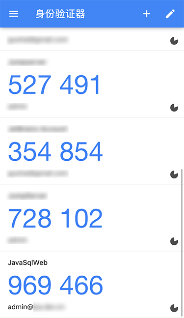
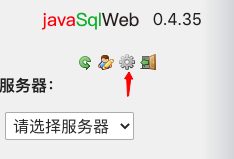
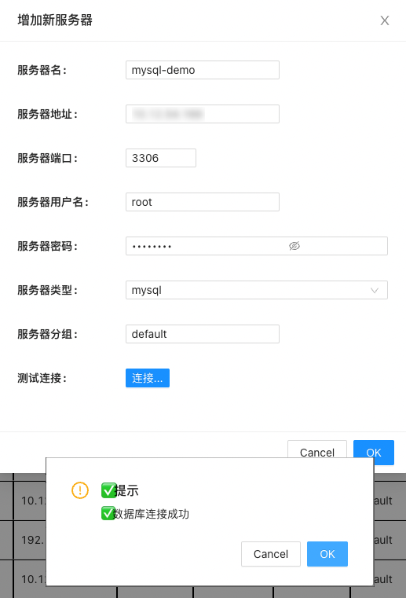
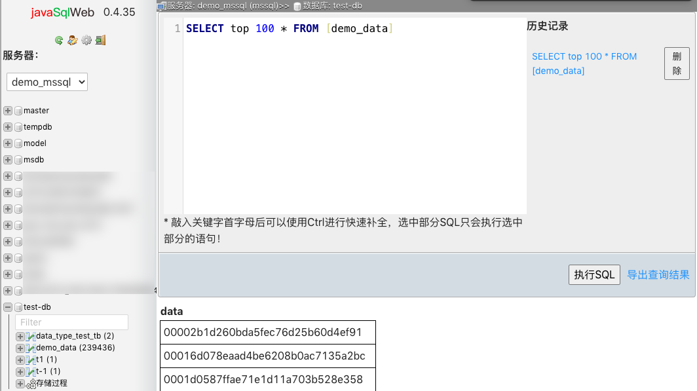

# JavaSqlWeb - 一个运营环境数据查询系统




## 项目介绍

所有企业都面临的一个需求就是需要开发人员连接线上生产库进行数据查询或解决线上问题，但又担心开发人员查询线上敏感数据甚至拖库。一般做法都是：

1. 通过限制查询人员、限制查询的表和字段。
2. 使用跳板机，所有查询都要在跳板机上进行。进出数据文件要过审查机制。
3. 使用第三方系统，记录每人的查询语句，并限制查询。

从上向下规则是越来越严。第一级直接由DBA进行查询账号权限限制即可，第二级推荐使用开源的[JumpServer](https://github.com/jumpserver) 。
第三级我在网上搜了下发现基本都是基于WEB的系统，查询语句入库限制查询结果。但能支持的数据库只有MySql没有发现能支持微软SqlServer的。
本项目就是在这个基础上准备开发的。

## 目前支持的功能列表

1. 多账号登录，强制二次验证【OTP】。
2. 查询的目标数据库支持SqlServer和MySql。使用druid数据库连接池
3. 数据库记录每次SQL执行脚本
4. 支持查询结果的csv格式导出
5. 脚本输入框语法高亮，智能提醒
6. 存储过程查看，个人执行语句记录

## 项目部署

### 环境安装

本项目使用Reactjs+Springboot+mysql的组合。最简项目运行可以使用Docker来运行。

```shell
# 首先下载数据库初始化脚本 
mkdir -p /opt/java-sql-web/script
cd /opt/java-sql-web/script
curl -O https://github.com/guohai163/java-sql-web/raw/master/script/init.sql
# 按初始化脚本编辑修改.sql文件。
vim init.sql

# 启动数据库容器,把刚下载好的init.sql文件映射到容器里的docker-entrypoint-initdb.d目录下。为了启动容器自动创建我们需要的库和表。参数MYSQL_ROOT_PASSWORD后为数据库root用户密码，请更换成更安全的
docker run --name jswdb -v /opt/java-sql-web/script:/docker-entrypoint-initdb.d -e  MYSQL_ROOT_PASSWORD=my-secret-pw -d mariadb:10
# 启动javasqladmin容器，如dockerhub无法连接可以使用备用的地址 docker.pkg.github.com/guohai163/java-sql-web/javasqlweb:0.5.0
docker run --name jsw_web --link jswdb:db -p 80:8002 -e MARIADB_PORT_3306_TCP_ADDR=db -e MARIADB_ENV_MYSQL_ROOT_PASSWORD=my-secret-pw gcontainer/java-sql-web:0.6.8
# 使用浏览器访问 
open http://localhost
```

### 系统使用

1. 使用浏览器打开上一步容器安装的机器IP。默认用户名密码为admin/admin。点击登录  

2. 为了保证系统的安全，首次登录我们需要绑定OTP动态码，可以点击下载安卓或iOS版本客户端。安装好后扫码即可得到6位的动态码。之后每次登录都要求输入该6位动态码。因我们使用HTOP算法来进行安全验证，请控制服务器的时间误差在30秒内，否则可能会提示动态码错误  
  


3. 进入主界面后我们先进入后台进行基本的设置管理。  


4. 首选我们看如何增加待管理的数据库服务器，选择服务器管理=>增加服务器。在弹层中添加你的服务器相关信息。


5. 我们顺便给平台在增加一个用户。点击账号管理=>增加用户，在弹层内输入新用户的账号和密码即可。所有用户首次登录都会强制要求绑定OTP。
6. 我们返回前台，看看主界面，主界面分为左右两部分，左侧主要为数据库和表的导航。右侧主要为SQL语句书写区，执行结果展示区。

  需要注意的是：

    1. 左侧库下面的表的数据信息部分会进行客户端本地缓存，缓存时长为24小时。可能表的行数不会实时返回到页面上。
    2. 右侧的SQL输入区支持SQL语法的快速补全，按下键盘的Ctrl键即可进行补全。
    3. 历史记录区域会按服务器进行区分，并缓存在浏览器本地。换浏览器后历史记录不会带走请注意。
    4. 对于查询结果，配置文件中可以进行限制一次最大返回条数，如果查询数据超过最大返回条数，客户端会进行弹层提示。
    5. 点击存储过程，可以快速查看存储过程的创建语句。

7. 后台日志：经过几次的试用可以去往后台的查询日志。可以看到用户的数据执行情况。


