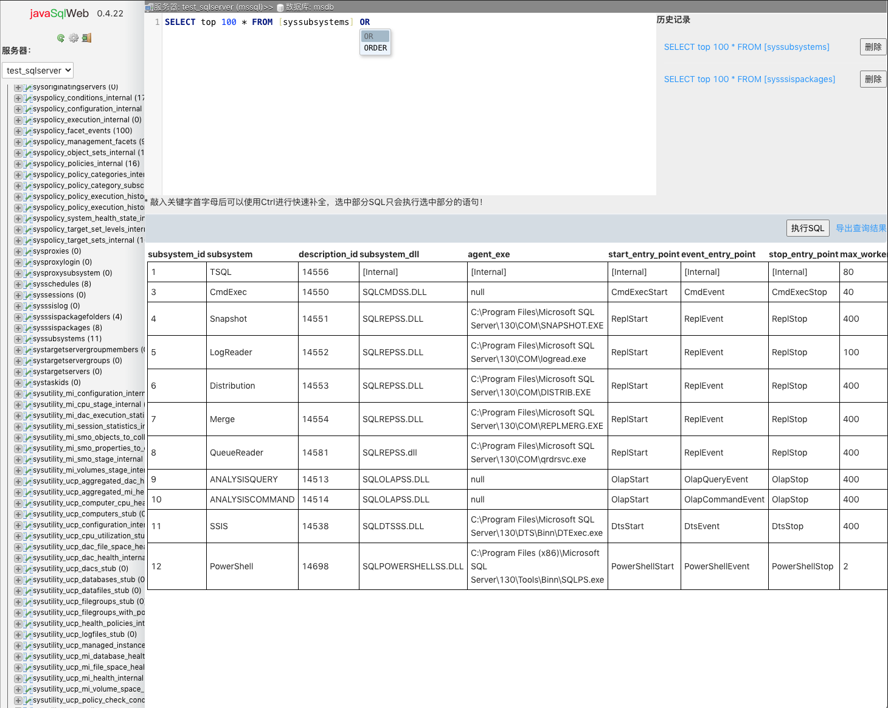
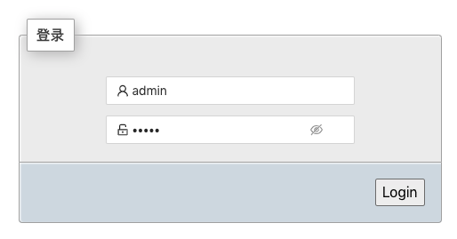
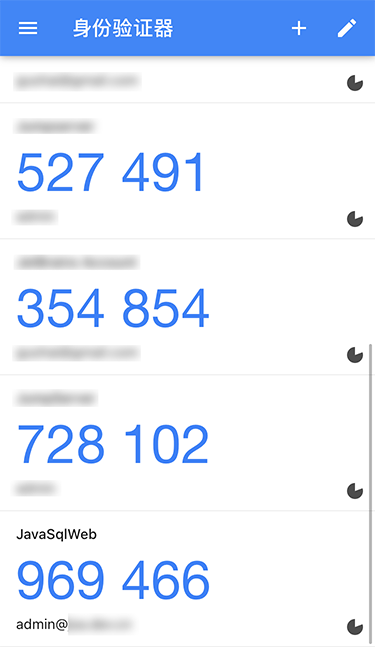
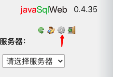
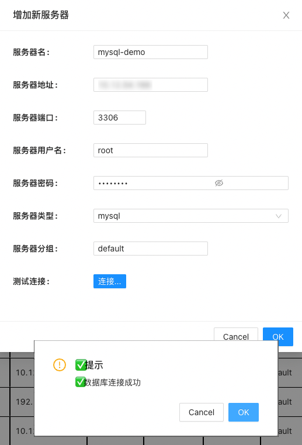
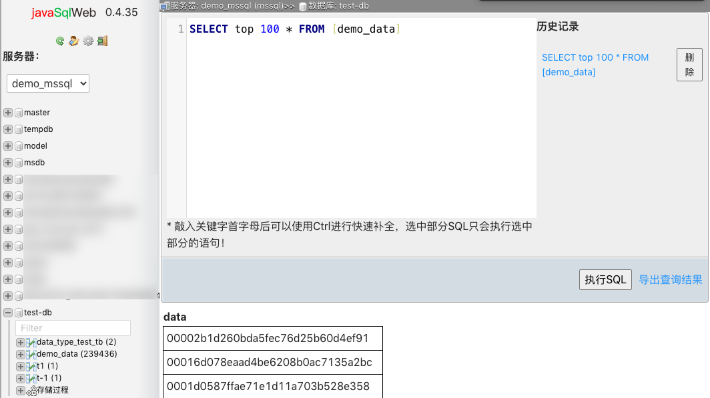

# JavaSqlWeb - 一个运营环境数据查询系统




## 项目介绍

所有企业都面临的一个需求就是需要开发/运维人员连接线上生产库进行数据查询或解决线上问题，但又担心开发人员查询线上敏感数据甚至拖库。一般做法都是：

1. 通过限制查询人员、限制查询的表和字段。
2. 使用跳板机，所有查询都要在跳板机上进行。进出数据文件要过审查机制。
3. 使用第三方系统，记录每人的查询语句，并限制查询。

从上向下规则是越来越严。第一级直接由DBA进行查询账号权限限制即可，第二级推荐使用开源的[JumpServer](https://github.com/jumpserver) 。
第三级我在网上搜了下发现基本都是基于WEB的系统，查询语句入库限制查询结果。但能支持的数据库只有MySql没有发现能支持微软SqlServer的。
本项目就是在这个基础上准备开发的。

## 目前支持的功能列表

1. 多账号登录，强制二次验证【OTP】。
2. 查询的目标数据库支持SqlServer和MySql。使用druid数据库连接池
3. 数据库记录每次SQL执行脚本，后台可查询用户查询日志
4. 查询结果支持仿excel方式展示和table方式展示，同时支持结果的csv格式导出
5. 脚本输入框语法高亮，表名字段名智能提醒。
6. 存储过程查看。
7. 用户权限分组。数据库服务器分组

## 目录结构

```text
.
├── front/                 # React 前端 + Nginx 镜像
├── server/                # Spring Boot 服务端 + Maven 构建
├── deploy/                # 部署相关文件，例如数据库初始化 SQL
├── docker-compose.yml     # 运行数据库、服务端、前端三个容器
└── .github/workflows/     # Git tag 触发的镜像发布流程
```

## 项目部署

### 1. 发布镜像

推送 Git tag 后，GitHub Actions 会自动构建并推送两个镜像到 GHCR：

```shell
git tag v0.9.0
git push origin v0.9.0
```

默认镜像名：

- `ghcr.io/guohai163/java-sql-web-front:<tag>`
- `ghcr.io/guohai163/java-sql-web-server:<tag>`

### 2. 使用 docker compose 部署

复制环境变量模板并按需修改：

```shell
cp .env.example .env
```

至少需要确认：

- `TAG`：要部署的镜像版本，例如 `v0.9.0`
- `DB_PASSWORD`：MariaDB root 密码
- `PUBLIC_DOMAIN` / `PUBLIC_HOST`：对外访问域名与完整 URL

启动服务：

```shell
docker compose up -d
```

容器职责如下：

- `jsw-front`：唯一对外入口，提供静态页面并将后端请求代理到 `jsw-server`
- `jsw-server`：Spring Boot API 服务
- `jsw-db`：MariaDB 数据库，首次启动会执行 `deploy/init.sql`

### 3. 本地构建镜像

```shell
nvm use

cd front
npm install
npm run build
cd ..

cd server
mvn -DskipTests package
cd ..

docker build -t jsw-front:local ./front
docker build -t jsw-server:local ./server
```

前端默认使用仓库根目录的 `.nvmrc`，目标 Node 版本为 `24`。本地开发前端时请在 `front/` 目录执行：

```shell
npm run dev
```

如果本地后端不是跑在 `http://localhost:8002`，可以在启动前设置：

```shell
VITE_BACKEND_ORIGIN=http://your-server:8002 npm run dev
```

### 系统使用

1. 使用浏览器打开上一步容器安装的机器IP。默认用户名密码为admin/admin。点击登录  

2. 为了保证系统的安全，首次登录我们需要绑定OTP动态码，可以点击下载安卓或iOS版本客户端。安装好后扫码即可得到6位的动态码。之后每次登录都要求输入该6位动态码。因我们使用HTOP算法来进行安全验证，请控制服务器的时间误差在30秒内，否则可能会提示动态码错误  
  


3. 进入主界面后我们先进入后台进行基本的设置管理。  


4. 首选我们看如何增加待管理的数据库服务器，选择服务器管理=>增加服务器。在弹层中添加你的服务器相关信息。添加完毕后可以点击[连接...]进行测试配置的测试


5. 我们顺便给平台在增加一个用户。点击账号管理=>增加用户，在弹层内输入新用户的账号和密码即可。所有用户首次登录都会强制要求绑定OTP。
6. 
7. 我们返回前台，看看主界面，主界面分为左右两部分，左侧主要为数据库和表的导航。右侧主要为SQL语句书写区，执行结果展示区。

  需要注意的是：

    1. 左侧库下面的表的数据信息部分会进行客户端本地缓存，缓存时长为24小时。可能表的行数不会实时返回到页面上。
    2. 右侧的SQL输入区支持SQL语法的快速补全，按下键盘的Ctrl键即可进行补全。
    3. 历史记录区域会按服务器进行区分，并缓存在浏览器本地。换浏览器后历史记录不会带走请注意。
    4. 对于查询结果，配置文件中可以进行限制一次最大返回条数，如果查询数据超过最大返回条数，客户端会进行弹层提示。
    5. 点击存储过程，可以快速查看存储过程的创建语句。

8. 后台日志：经过几次的试用可以去往后台的查询日志。可以看到用户的数据执行情况。


### 计划实现的功能

1. 前端脚本部门有计划使用TS进行重写
